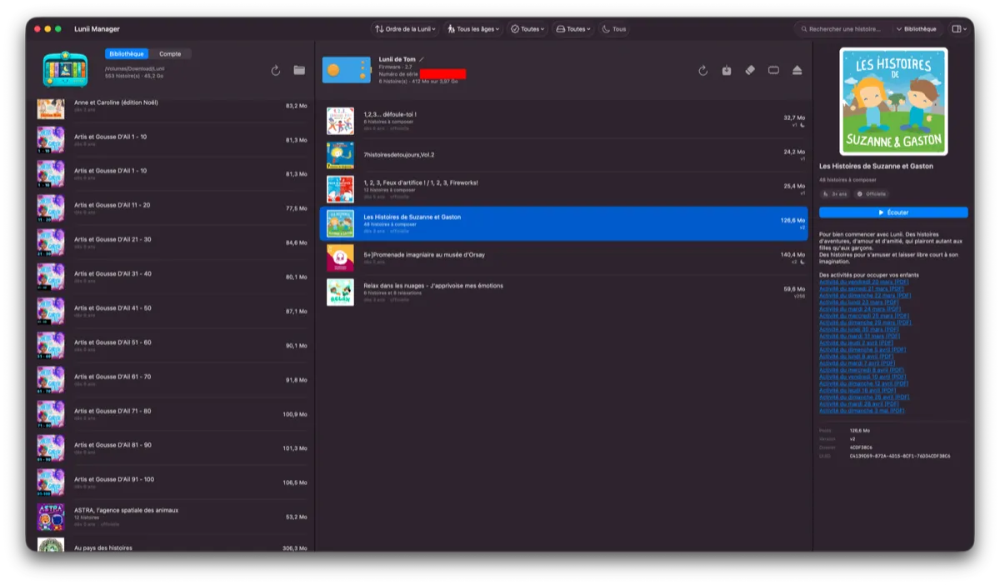
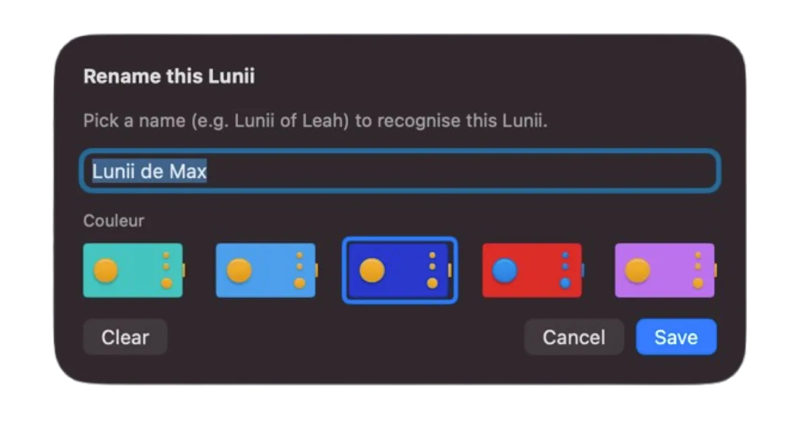
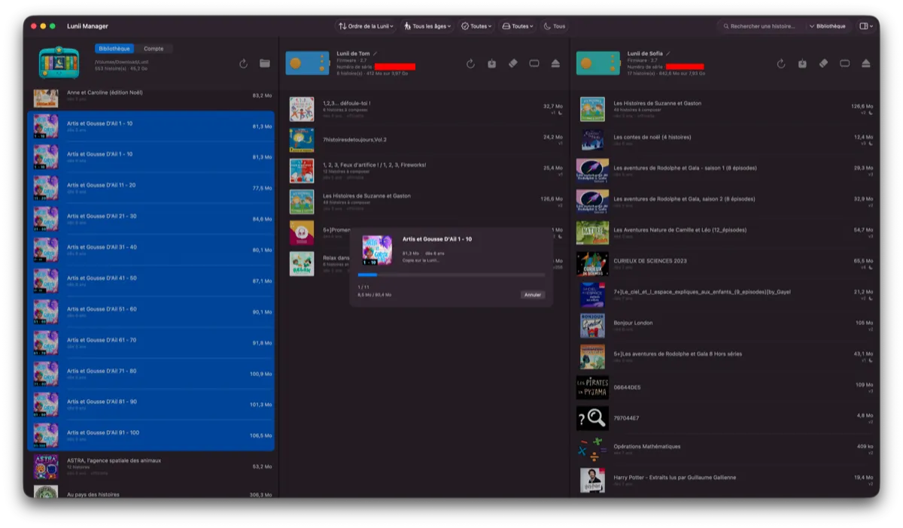
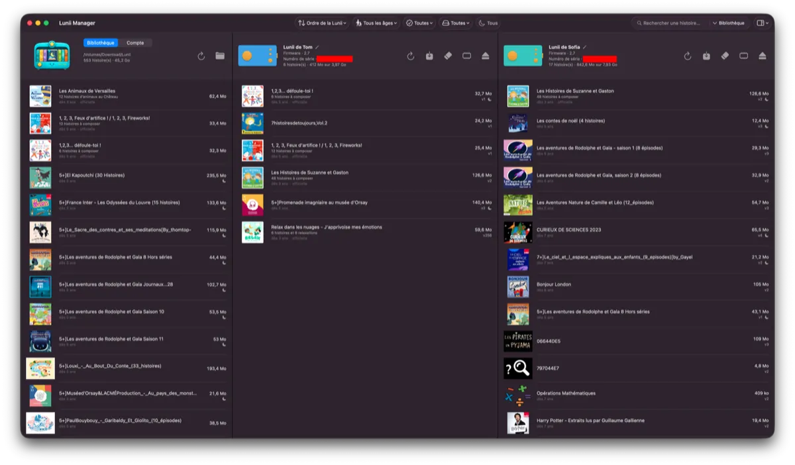
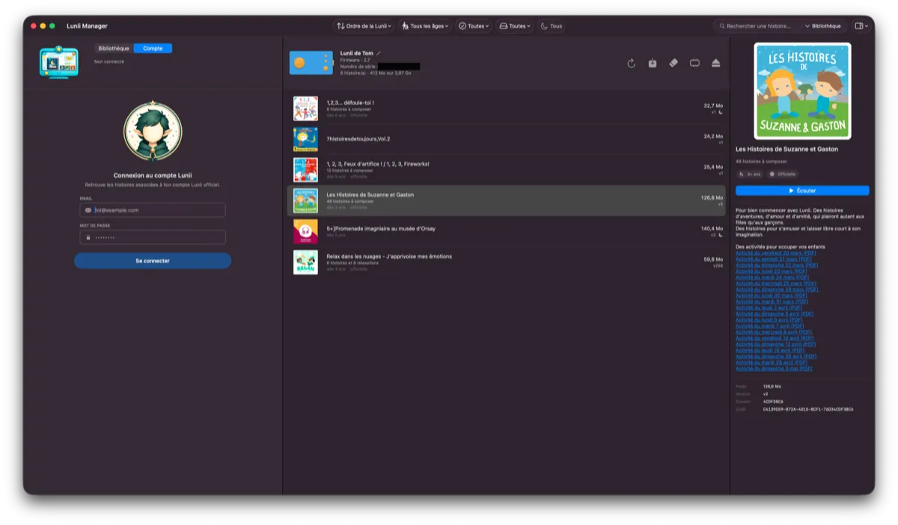
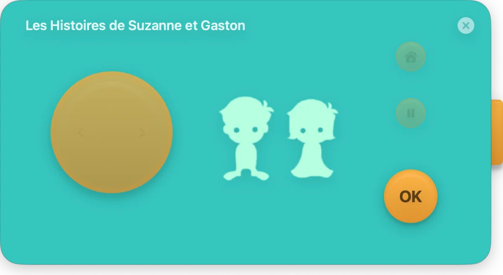
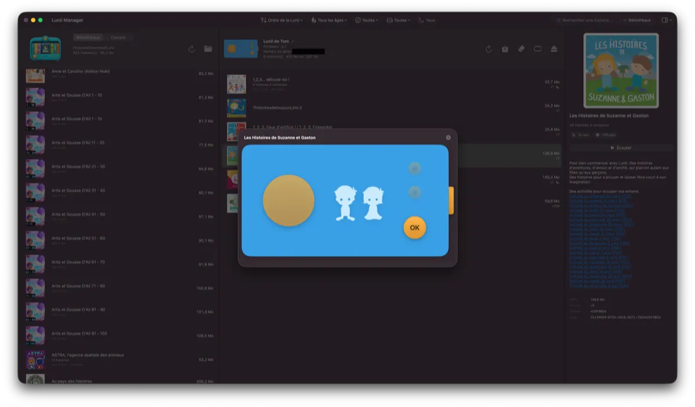
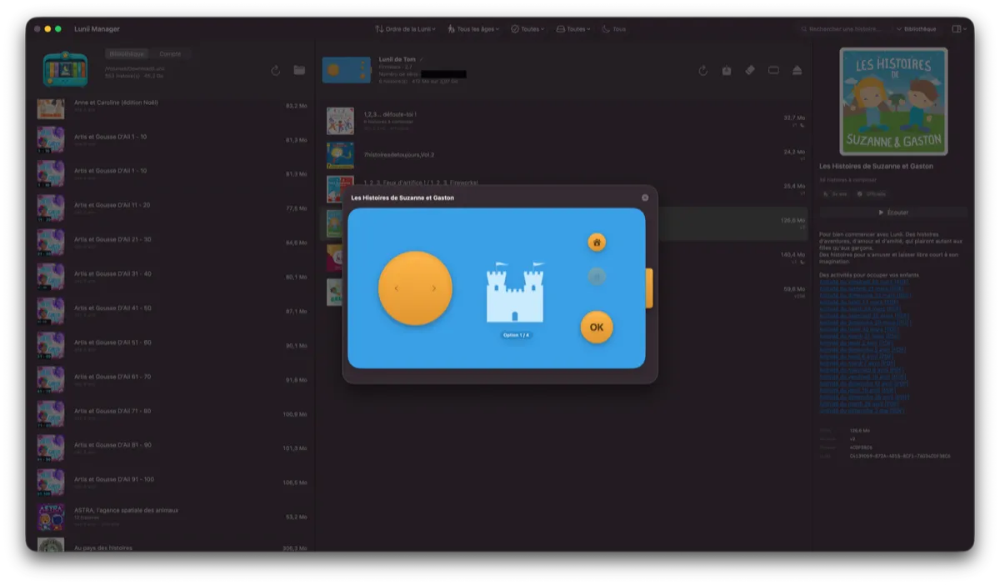

# Lunii Manager

A native macOS app to manage stories on your **Lunii v2** storyteller, without going through Luniistore.

Local library, drag-and-drop, built-in player, official Lunii account sign-in, firmware updates — all packaged in one self-contained app that runs offline whenever it can, and adapts to the way you actually organize your stories.

---

## What you can do

### A library you own

Keep every story you have (bought, shared, custom-made with Lunii Studio) in **one folder** — on your Mac or even on a NAS share. Lunii Manager scans the folder (and all its subfolders), shows each pack with its cover, title, age range, size, and lets you filter / sort however suits you.

- Drop in `.zip` or `.7z` archives — either Lunii Studio editor exports or the FS-backup format Lunii Manager produces itself.
- Live search on title, subtitle, description, file name or UUID.
- Filters: age range ("from 5 years", "up to 7 years"…), official vs. custom, already on the Lunii or not, night-mode availability.
- Sort by title, age, weight, date added.
- Stories built with Lunii Studio (raw editor zips) get **automatically converted** to the Lunii format (BMP images, MP3 mono audio) at install time — no third-party tools needed.

### Effortless device management

Plug your Lunii in over USB and it shows up in the window with its nickname, colour, serial number, firmware version and free space.

- **Rename** your Lunii ("Léa's Lunii", "Lucas's Lunii"…) and pick its real shell colour.
- **Reorder stories** by drag-and-drop, push one to the top, to the bottom, or remove it with a single click.
- **Back up** every story on a Lunii into your library in one click.
- **Wipe** the Lunii (clears all stories, keeps the device settings).

### Drag and drop everywhere

- Drag a story from your **library** onto your **Lunii** to copy it over.
- Drag a story from your **Lunii** back into your **library** to save it.
- Drag a story **from one Lunii to another** when two are plugged in.

### Several Lunii at once

Plug in two (or more) and each one gets its own pane, with independent selection and its own drop target.

### Official Lunii account

Sign in with your real Lunii account (the one on `lunii.com`) to get back every story you've bought or have through your subscription. You can download any of them straight onto any connected Lunii — no need to go through Luniistore at all.

### Built-in player

Want to listen to a story without putting it on the Lunii? Click **"Listen"** from any story (library or device) and the player opens up: it **looks like a real Lunii**, painted in your Lunii's colour, with the wheel, OK / Home / Pause / ⏯ buttons and the same navigation as the real device.

It plays MP3, WAV, OGG Vorbis and FLAC. Keyboard shortcuts: left / right arrows for the wheel, Return for OK, H for Home, Space for pause.

### Firmware updates

When the Lunii servers offer a new firmware for your device, Lunii Manager picks it up, downloads it, verifies its integrity and stages it onto the SD card. The actual flash happens on the Lunii's next boot — exactly like Luniistore. **You can still roll back**: as long as you haven't unplugged + replugged the Lunii, open the mounted volume in Finder and delete the `FU.BIN` / `FA.BIN` files at its root — the next boot will then ignore the staged firmware.

### Multilingual

UI translated into **French, English, German, Spanish, Italian, Portuguese, Dutch, Polish, Swedish and Danish**. Follows your macOS system language by default, or pick it manually from the **Lunii Manager → Language** menu.

---

## Requirements

- **macOS 14 (Sonoma) or later.**
- **Apple Silicon Mac** (M1, M2, M3 or M4). Intel Macs are not supported.
- **Lunii v2 only** (firmware 2.x) for now. The **v3** (with the colour screen) and the **FLAM** devices are **not supported yet**.
  - The Lunii v1 *hybrid* model (early hardware re-flashed to firmware v2) works just like a v2.

---

## Installation

1. Download the `.dmg` from the releases page.
2. Open the `.dmg` and drag **Lunii Manager** into **Applications**.
3. The first launch will be blocked by macOS Gatekeeper because the app isn't signed by a paid Apple Developer ID: **right-click Lunii Manager → Open**, then confirm. macOS will remember from then on.
4. The first time you plug in a Lunii, macOS will ask you to grant access to **removable volumes**: allow it. If your library is on a NAS, also allow access to **network volumes**.

> Clicked "Don't Allow" by mistake? **Lunii Manager → Reset permissions…** replays the system prompt.

---

## Notes

- **Free software, personal non-commercial use only.** Not affiliated with Lunii SAS — this is an independent project. *Lunii* is a trademark of Lunii SAS.
- **If you paid for this app, you got scammed**: it's not sold anywhere.
- No external dependencies: no Homebrew, no Python, nothing else to install. Just drag the `.app`.

---

## License

Software provided "as is", without any warranty. All rights reserved — no redistribution, modification, sublicensing or commercial use without prior written permission.

© FJ81
